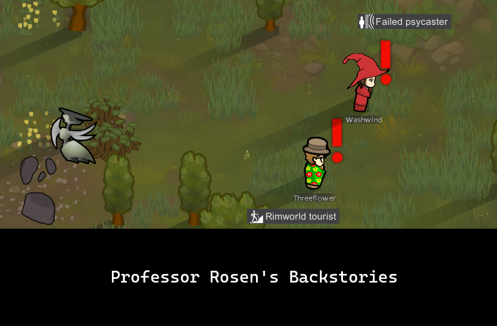

# Rosen-Backstories

Part serious mod, part attempt to learn to mod RimWorld.  Many of the backstories are academically focused.  The mod does not require additional mods, but some backstories will take advantage of Vanilla Traits Expanded and Vanilla Armour Expanded if you have them.  Part of the motivation is to add more variety to the "Researcher" category of backstories.\nMost of the backstories have a thematically appropriate forced trait, which makes debugging a bit easier for me.  For example, the "Waste of Talent" backstory forces the Slowpoke and Slothful traits.
